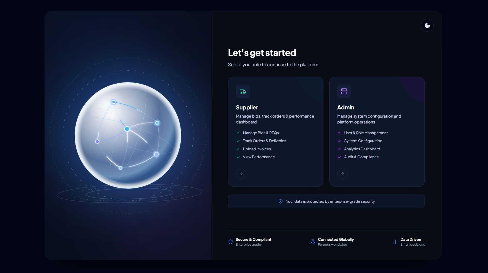
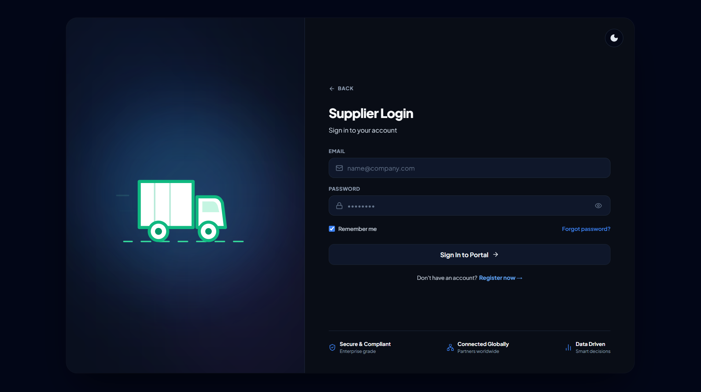
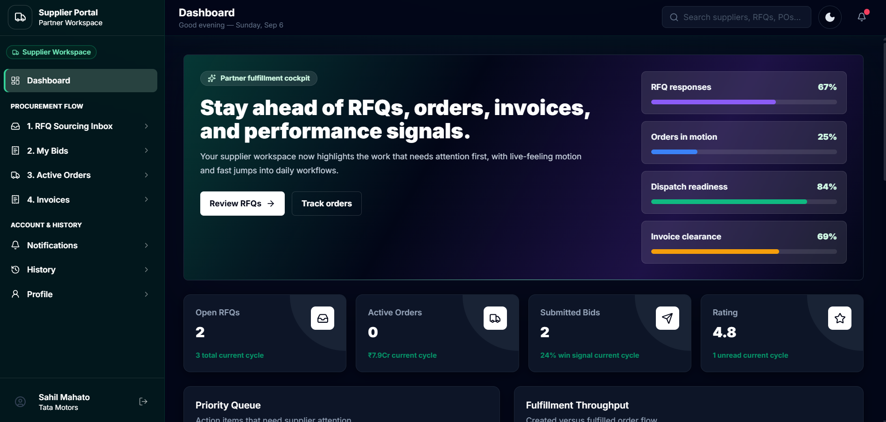
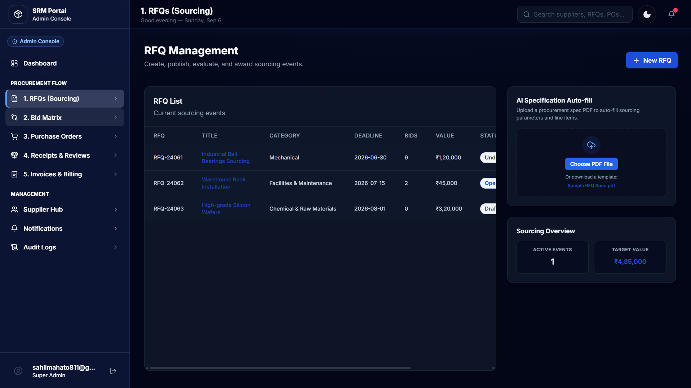
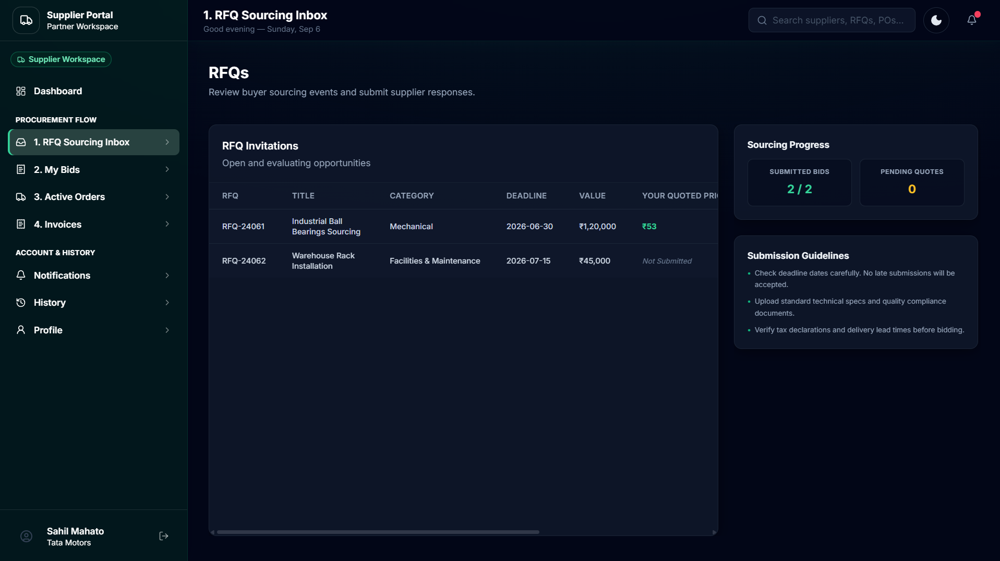
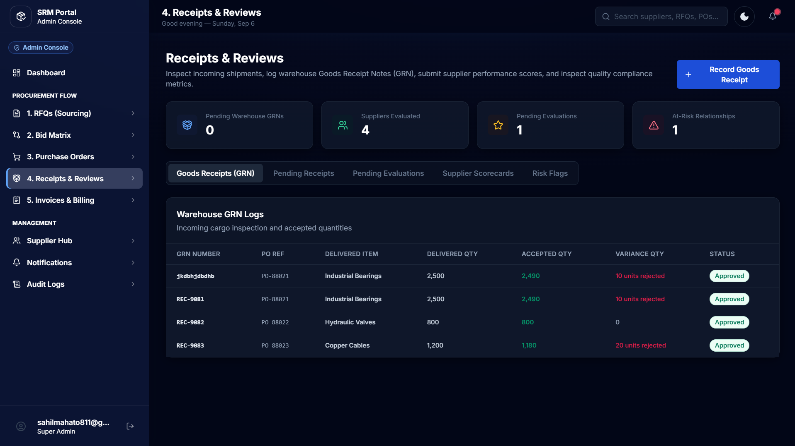

# Supplier Relationship Management Portal

A full-stack Supplier Relationship Management (SRM) Portal designed to digitize and streamline supplier and procurement workflows through a centralized web-based platform.

## 🚀 Overview

The Supplier Relationship Management Portal provides a centralized platform for managing supplier-related activities and procurement operations.

The system is designed to simplify communication between organizations and suppliers while providing structured workflows for RFQs, bidding, orders, goods receiving, product offerings, and reporting.

## ✨ Features

- 🔐 User authentication and authorization
- 👥 Supplier management
- 📦 Product and offering management
- 📄 Request for Quotation (RFQ) management
- 💰 Supplier bidding system
- 🛒 Purchase order management
- 🚚 Goods receiving management
- 🧾 Invoice management
- 📊 Reports and dashboards
- 🔔 Notifications
- 📋 Order history and tracking
- 👤 Supplier profile management

## 📸 Screenshots

### 🏠 Landing Page



### 🔐 Supplier Login



### 🏭 Supplier Dashboard



### 📋 RFQ Management



### 💰 Bidding Page



### 📦 Receipts & Reviews



## 🛠️ Tech Stack

### Frontend

- React.js
- JavaScript
- Tailwind CSS
- Vite

### Backend

- PHP
- REST APIs

### Database

- MySQL
- phpMyAdmin

### Development Tools

- Git
- GitHub
- XAMPP
- VS Code

## 🏗️ Project Structure

```text
SRM_PROJECT/
│
├── backend/          # PHP backend and APIs
├── docs/             # Project documentation
├── mock_pdf_tests/   # Testing resources
├── public/           # Public assets
├── src/              # React application
│
├── .gitignore
├── index.html
├── package.json
├── package-lock.json
├── tailwind.config.js
├── vite.config.js
└── README.md